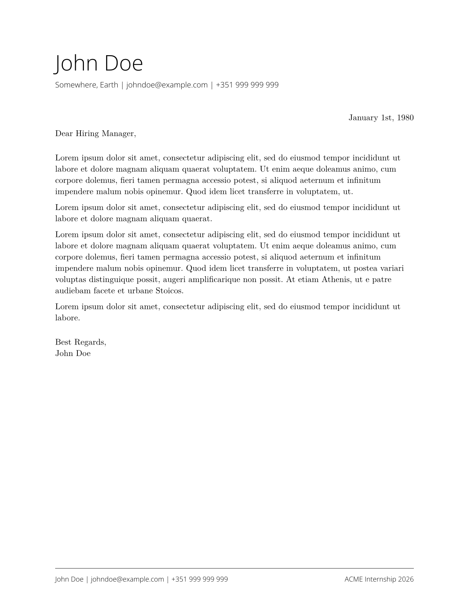

# Minimalistic Cover Letter

This repository contains a minimalistic cover letter template, that I've
designed myself. Contributions are welcome!

## Example

The template creates a document that looks like this:



## Requirements

This template requires that you have the following fonts available:

- Open Sans
- New Computer Modern

## Usage

### Universe (Typst Package Repository)

This template has not been published to Universe yet.

### Local Package Repository

You can download this repository to your local Typst package repository. Then,
to instantiate the template simply run the following command:

```bash
typst init @local/minimalistic-cover-letter:0.1.0
```

### Using Nix (with Flakes)

If you're using Nix with Flakes enabled, you can use the following example Flake
to install the package.

```nix
{
    inputs = {
        nixpkgs.url = "...";

        minimalistic-cover-letter.url = "github:limwa/minimalistic-cover-letter";
        minimalistic-cover-letter.inputs.nixpkgs.follows = "nixpkgs";
    };

    outputs = {
        nixpkgs,
        minimalistic-cover-letter,
        ...
    }: {
        devShells."<system>".default = let
                pkgs = import nixpkgs {
                    system = "<system";
                };
            in pkgs.mkShell {
                packages = with pkgs; [
                    (typst.withPackages (ps: [
                        minimalistic-cover-letter.packages."<system>".default
                    ]))
                ];
            };
    }
}
```

Then, go into the devShell using `nix develop .#` and then instantiate the
template using the following command:

```bash
typst init @preview/minimalistic-cover-letter:0.1.0
```
